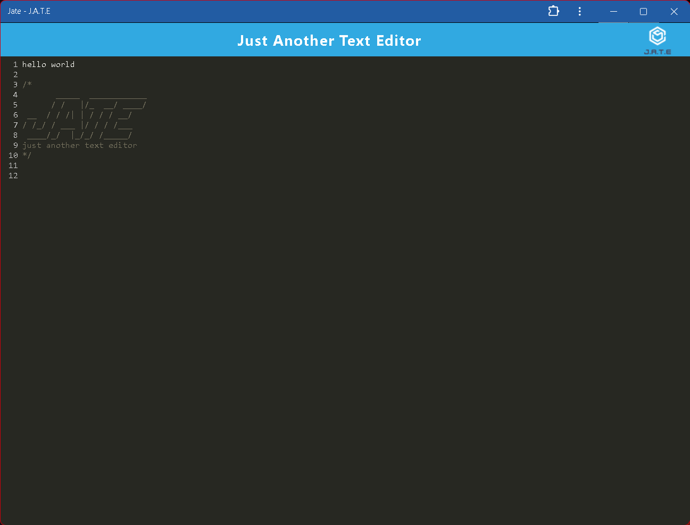

# Text Editor

## Overview
This is a texteditor that can  create notes or code snippets with or without an internet connection that I can relibly be accessd for later use .

## Author
Daniel Dennis 
lyoko 

## Technologies Used
- Progressive Web App 
- Service Workers
- JavaScript
- IndexedDB
- Render
- Node.js and npm
- HTML/CSS

## Usage
1. Users can create and edit notes or code snippets directly in the browser. This is useful for developers and anyone needing to jot down quick notes or code.

2. The application is a Progressive Web App (PWA), meaning it can function without an internet connection. Users can continue working on their notes even when offline, and the data will be saved locally.
 
 3. This app uses IndexedDB for data storage, so that users' notes are saved and can be retrieved later, even if they close and reopen the browser.

 4. Users can install the web application as a standalone app on their desktop. 

## Contact
For any questions or suggestions, please contact me at lyoko1629@gmail.com

